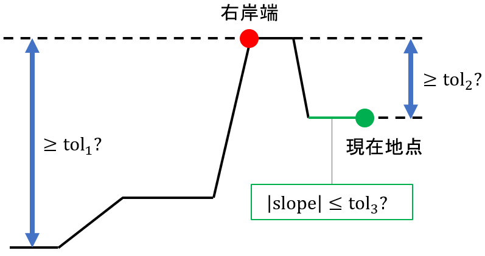

## 基本パラメータ詳細解説 (basic_parameters.csv)

`basic_parameters.csv` の全25項目の詳細な設定方法およびアルゴリズムの仕様を整理します．

#### Plane rectangular coordinate system
対象の河道をカバーする平面直角座標系のEPSGコードを "epsg:6680" のように記載して下さい．コードは以下のURLから検索できます．
[https://lemulus.me/column/epsg-list-gis#2011JGD2011](https://lemulus.me/column/epsg-list-gis#2011JGD2011)

#### Initial point ID, Terminal point ID
上流端および下流端のポイント識別番号です．上流端は抽出範囲より1kmほど上流に設定することを推奨します．

#### Flow
対象河川の代表地点の平水流量（m3/s）です．デフォルトでは，`basic_parameters.csv`の設定が全ての横断面に適用されます．
[水文水質データベース](http://www1.river.go.jp/)等から取得して下さい．
データが入手できない場合は，[J-FlwDir](https://hydro.iis.u-tokyo.ac.jp/~yamadai/JapanDir/)の集水面積から比流量を用いて設定して下さい．

#### Estimate water depth
DEMから得られない水面下の水深を推定するかどうか（0：しない，1：する）の設定です．

#### Clear crossings
横断面の交差を自動で解消するかどうか（0：しない，1：する）の設定です．

#### tol1-3（境界探索しきい値）
横断面の左右岸端の位置設定に利用されます．デフォルトでは，`basic_parameters.csv`の設定が全ての横断面に適用されます．河道中心線から外側へ進みながら，以下の3条件が満たされた地点で標高読み取りが停止し，最高地点を岸端とします．
1. 最低標高と最高標高の差が `tol1`(m)以上
2. 現在地点の標高と最高標高の差が `tol2`(m)以上
3. 現在地点の勾配が `tol3`以下


#### tol4-5, adjust1-3（自動調整）
探索が永久に終わらないのを防ぐため，中心線から `tol4`(m)以上離れるか，最低標高より `tol5`(m)以上高くなった場合，`tol1-3` に `adjust1-3` を乗じて再探索します．
デフォルトでは，`basic_parameters.csv`の`tol4`, `tol5`の設定が，全ての横断面に適用されます．

#### DEM type
使用するDEMの種類です．デフォルトでは，`basic_parameters.csv`の設定が全ての横断面に適用されます．設定値は以下のいずれかです．
- 5mメッシュDEM: `A`, `B`, `C`
- 1mメッシュDEM: `1A`

`A`と書いておけば，読み取り地点ごとにDEMの利用可能性を調べ，5A→5B→5Cの優先順位で自動選択を行います．

#### Distance between sections
河道中心線に沿った，横断面の取得間隔（m）です．

#### Transverse interval
横断方向の標高取得間隔（m）です．

#### Margin
岸端の外側に取るマージンの上限（m）です．0mに設定すると河道外を切り捨てます．

#### iRIC format
河道縦横断データの出力形式です．設定値は以下のいずれかです．
- 1: iRIC形式
- 0: DioVISTA/Flood形式

#### 水深推定用パラメータ<a name="depth_estimation"></a>

このプログラムが用いる，河床標高の設定方法を述べます．このプログラムは，広矩形単断面を持つ開水路の不等流計算の基礎式である，
```math
\frac{dH}{dx} + \frac{1}{2g} \frac{d}{dx} \left( \frac{Q}{Bh} \right)^2 + \frac{n^2 Q^2}{B^2 h^{10/3}} = 0
```
を用いています．ここで，$`H`$は水面標高(m)を，$`x`$は河道の縦断距離(m)（上流側を正に取る）を，$`g`$は重力加速度(m/s$`^2`$)を，$`Q`$は流量(m$`^3`$/s)を，$`B`$は横断方向の水面の幅(m)を，$`h`$は水深(m)を，$`n`$は粗度係数(m$`^{-1/3}`$s)を表します．各横断面における水面の幅$`B`$と，水面標高$`H`$は，DEMから推定することができます．よって，各横断面における平水流量$`Q`$を与えれば，この微分方程式を用いて，各横断面における未知の水深$`h`$を計算できます．

[basic_parameters.csv](./basic_parameters.csv)の末尾の6つのパラメータは，この微分方程式に関するものです．

- Water surface tolerance: 最小標高から何mまでの範囲を水面と見なすか
- Difference in differential equation: 上記微分方程式を$`x`$軸方向に離散化する際の差分間隔(m)
- Roughness coefficient: 粗度係数$`n`$
- Minimum water surface slope: 水面標高の勾配の最小値$`\eta_\mathrm{min}`$
- Number of samples for median water surface: 水面標高を平滑化する際に利用する横断面数$`M_1`$
- Number of samples for median riverbed: 河床標高を平滑化する際に利用$する横断面数`M_2`$

[river_extractor.py](./river_extractor.py)は，以下の手順に従い，DEMから水面の標高$`H`$を推定します．

まず，各横断面$`i`$について，堤外地の最小標高を水面標高と見なし，$`\tilde{H}_i`$とします．そのうえで，複数の横断面について，$`\tilde{H}_i`$の中央値を取ることにより，平滑化を行います．
```math
\hat{H}_i = \mathrm{median} \left[ \tilde{H}_{i-r_1(i)}, \cdots, \tilde{H}_{i+r_1(i)} \right]
```
```math
r_1(i) = \min \left[ M_1 \div 2 , N - i, i - 1 \right]
```
ここで，$`r_1(i)`$は，中央値の計算に用いる横断面を，横断面$`i`$の前後それぞれにいくつ設けるのかを表します．$`M_1 \ge 1`$はユーザーにより設定される奇数の定数です．$`N`$は横断面の総数です．横断面1は最下流の横断面，横断面$`N`$は最上流の横断面とします．対象の河道の上流端と下流端では，横断面$`i`$の前後に$`M_1 \div 2`$個の横断面を設けられないため，それよりも少ない個数の横断面を用いて中央値が計算されます．

$`\hat{H}_i`$を用いても，下流側の水面標高が上流側の水面標高よりも高くなることがあります．そこで，水面の標高が河道を下るのに伴い単調に減少するように，
```math
H_N = \hat{H}_N
```
```math
H_i = \min \left[ \hat{H}_i, H_{i+1} - \eta_\mathrm{min} D \right] \quad (1 \le i < N)
```
と設定します．ここで，$`D`$(m)は隣り合う横断面間の距離です．$`\eta_\mathrm{min}>0`$はユーザーにより設定される定数であり，水面勾配の最小値を表します．

次に，各横断面$`i`$について，水面の幅$`B_i`$を求めます．2025年3月以降に更新されたDEMと，それ以前のDEMでは求め方が異なります．

- 2025年3月以降に更新されたDEM: 堤外地の最小標高から$`\Delta_i`$(m)以内の範囲の標高を有する区間を水面と見なす．
- それ以前のDEM: 標高データが欠測している区間を水面と見なす．

$`\Delta_i`$のデフォルト値はWater surface toleranceです．以上の対応の違いはDEMにおける水域の扱いに由来します．2025年3月以降に更新されたDEMでは，水域の標高として水面の標高が記録されているのに対して，それ以前のDEMでは，水域の標高が欠測しています．

以上により得られた$`H_i`$, $`B_i`$を，開水路の不等流計算の基礎式に代入して水深$`h_i`$を計算します．河床標高は$`H_i - h_i`$として評価できますが，この評価値は縦断方向に大きく変動します．そこで，$`H_i - h_i`$の中央値を取ることにより，平滑化処理をします．
```math
\underline{z}_i = \mathrm{median} \big[ H_{i-r_2(i)} - h_{i-r_2(i)}, \cdots, H_{i+r_2(i)} - h_{i+r_2(i)} \big]
```
```math
r_2(i) = \min \left[ M_2 \div 2 , N - i, i - 1 \right]
```
$`\underline{z}_i`$が河床標高の設定値となります．$`M_2 \ge 1`$はユーザーにより設定される奇数の定数です．

このフォルダに置かれている[basic_parameters.csv](./basic_parameters.csv)では，$`\Delta_i`$のデフォルト値に1mを，粗度係数$`n`$に0.03を，$`\eta_\mathrm{min}`$に10万分の1を，$`M_1`$に11を，$`M_2`$に100万1（可能な限り多くの横断面を利用）を設定しています．$`\eta_\mathrm{min}`$の設定値を変える場合，ゼロにはできないことに注意して下さい．ゼロにすると∞の水深が発生して計算が停止することがあります．

## settings.csv の詳細仕様

`settings.csv`は，横断面ごとに個別の抽出条件を設定するためのファイルです．GUI上では一部の重要な項目についてのみ編集が行えます．細かい調整を行いたい場合には，このファイルをExcelなどで開いて編集して下さい．

### 基本項目
| カラム名 | 定義・詳細 |
| :--- | :--- |
| **Distance** | 下流端からの距離(km)． |
| **Use intermediate result** | **1**を設定すると，前回の実行時に保存された標高データ（`intermediate_result.csv`）を再利用します．断面の位置や角度を変更していない場合に計算を高速化できます． |
| **Flow** | 断面ごとの平水流量($m^3/s$)．水面標高の推定計算において基礎となる流量です． |
| **Angle adjustment** | 河道中心線に対する断面線の回転調整（反時計回り，度）．中心線に対して断面が垂直でない場合に補正します． |

### 断面範囲・岸端設定（Left / Right 共通）
左右岸それぞれに対して，以下の抽出閾値（tol）や条件を指定できます．

- **Manual (左手動/右手動)**: 自動推定を無効にし，手動設定を行う場合に**1**を設定します．
- **DEM (Left DEM/Right DEM)**: その断面で使用するDEMの種別（A, B, C, 1A）を指定します．左右で異なるDEMを参照することも可能です．
- **tol1-5**: 断面形状を認識するための閾値群です．

### W.S.T.<a name="wst"></a>

`W.S.T.`は，Water surface toleranceの略で，`basic parameters.csv`で設定される`Water surface tolerance`と本質的に同じものです．

[水深推定用パラメータ](#depth_estimation)で述べたように，DEM 5Aの仕様が2025年3月以降に更新されたものと，それ以前のものでは異なっており，仕様に応じて水面の区間の推定方法を変える必要があります．

`W.S.T.`が0の場合は，DEMの仕様をプログラムが自動的に判定します．

2025年3月以降の仕様と判断した場合には，`basic parameters.csv`の`Water surface tolerance`を$`\Delta_i`$に設定して，水面の区間の推定を行います．

## レアな問題への対処方法

### DEMから標高が得られない

稀なケースですが，DEM5Aの標高データが存在する場所と存在しない場所が混在する3次メッシュがあります（例えば[6441-54-52](https://maps.gsi.go.jp/#14/43.125638/141.527853/&base=std&ls=std%7Cchiikimesh%7Cfgd_dem5a_area_dtil&disp=111&lcd=fgd_dem5a_area_dtil&vs=c1g1j0h0k0l0u0t0z0r0s0m0f0&d=m)）．

こうした場所でDEM5Aを利用しようとすると，横断面形の設定が適切に行えません．

このような横断面については，`settings.csv`をExcelなどで開き，`Left DEM/Right DEM`を`B`または`C`に変更して下さい．

### 水面の幅の設定の失敗

[settings.csv](#wst)の説明で述べたように，`W.S.T.`が0の場合は，横断面ごとにDEMの新旧仕様をプログラムが自動的に判定します．

この自動判定が失敗し，2025年3月以降のDEMに対して，それ以前のDEMに適用すべき推定手法が用いられると，水面の区間の幅の過小評価に繋がります．

このような場合には，`settings.csv`をExcelなどで開き，`W.S.T.`を1.0($m$)などの適切な正の値に設定して下さい．
