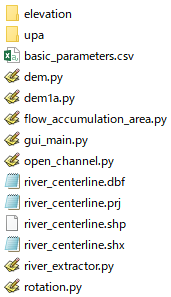

このリポジトリでは，日本の数値標高モデル（Degital Elevation Model, DEM）と国土数値情報の河川データから，氾濫解析用の河道縦横断データを自動抽出するPythonプログラムを公開しています．

このREADMEではプログラムの使用方法を段階に分けて説明します．

## 1. 必要なライブラリのインストール

このプログラムを用いるには，以下の2件のPythonライブラリが必要です．

- [PyShp](https://pypi.org/project/pyshp/)
- [Pyproj](https://github.com/pyproj4/pyproj)

お使いのPython環境にこれらのライブラリがインストールされていない場合は，プロンプト上で以下のコマンドを入力して下さい．
```
pip install pyshp
```
```
pip install pyproj
```

## 2. 河道中心線の抽出

国土数値情報の河川データから，縦横断データの抽出対象となる河川の河道中心線のデータを取得します．

### 2-1. 河道中心線の抽出を行うプログラムの準備

"[extract-centerline](./extract-centerline)"に格納されている以下の2つのファイルをダウンロードし，同一のディレクトリに置いて下さい．

- [extract_centerline.py](./extract-centerline/extract_centerline.py)
- [input_extract_centerline.csv](./extract-centerline/input_extract_centerline.csv)

### 2-2. 国土数値情報・河川データの準備

下記URLから，対象の河川を含む都道府県のデータをダウンロードして下さい．

[https://nlftp.mlit.go.jp/ksj/jpgis/datalist/KsjTmplt-W05.html](https://nlftp.mlit.go.jp/ksj/jpgis/datalist/KsjTmplt-W05.html)

ダウンロードしたzipファイルに含まれている，W05-XX-XX.xmlという名前のファイルを"extract_centerline.py"の置かれたディレクトリに置いて下さい．

### 2-3. 河川コードの指定

"input_extract_centerline.csv"を開き，1行2列に国土数値情報のxmlファイルの名前（W05-XX-XX.xml）を，2行2列に対象の河川の河川コードを入力して上書き保存して下さい．

河川コードは以下に示す，国土交通省のWebサイトで検索できます．

[https://nlftp.mlit.go.jp/ksj/gml/codelist/RiverCodeCd.html](https://nlftp.mlit.go.jp/ksj/gml/codelist/RiverCodeCd.html)

このリポジトリに置かれている"[input_extract_centerline.csv](./extract-centerline/input_extract_centerline.csv)"では，北海道の河川データのxmlファイルと，石狩川の河川コードが指定されています．

### 2-4. プログラムの実行<a name="2-4"></a>

"[extract_centerline.py](./extract-centerline/extract_centerline.py)"を実行して下さい．

```
python extract_centerline.py
```

プログラムが終了すると，以下の2種類のシェープファイル（およびその支援ファイル）が出力されます．

- river.shp: 指定された河川の河道中心線のラインデータを格納したファイル
- river_points.shp: "river.shp"のラインデータを構成するポイントのデータを格納したファイル

## 3. 河道縦横断データの抽出範囲の決定<a name="3"></a>

[2-4](#2-4)で取得した"river_points.shp"をGISソフトウェアで開いて下さい．

例として，石狩川の"river_points.shp"をQGISで開き，石狩川河川敷公園（座標：43.130921N, 141.533418E）付近を拡大表示したものを以下の図に示します．


"river_points.shp"に格納されているポイントデータは，属性として"id"という識別番号を持ちます．

識別番号は上流から下流に向けて昇順に並んでいます．

上の図に示した石狩川の例では，2つのポイントデータの識別番号が表示されています．図の左（下流側）のポイントの識別番号は5981，右（上流側）のポイントの識別番号は5967です．

"river_points.shp"のデータをGISソフトウェア上で閲覧しながら，河道縦横断データの抽出範囲を決めて下さい．

抽出範囲を決めたら，その範囲の上流端のポイントの識別番号と，下流端のポイントの識別番号をメモして下さい．これらの識別番号は，河道縦横断データの抽出を行うプログラムに対して，抽出範囲を指示するために用いられます．

上流端のポイントは，抽出したい範囲から1kmほど上流に設定して下さい．これは，河道縦横断データの抽出を行うプログラムが，下流端のポイントから標高の読み取りを開始し，上流端のポイントの直前で標高の読み取りを終了するためです．そのため，上流端のポイントの標高は読み取られません．

なお，"river_points.shp"は，利用者が河道縦横断データの抽出範囲を決定するために用いるファイルであり，河道縦横断データの抽出を行うプログラムには利用されません．

## 4. 河道縦横断データの抽出（初回）

### 4-1. プログラムの準備

"[code](./code)"に格納されている以下の4つのファイルをダウンロードし，同一のディレクトリに置いて下さい．

- [extract_river_channel_shape.py](./code/extract_river_channel_shape.py)
- [dem.py](./code/dem.py)
- [open_channel.py](./code/open_channel.py)
- [basic_parameters.csv](./code/basic_parameters.csv)

### 4-2. 河道中心線のデータの準備

[2-4](#2-4)で取得した"river.shp"とその支援ファイルを"extract_river_channel_shape.py"の置かれたディレクトリに置いて下さい．

### 4-3. DEMデータの準備

下記URLから，河道縦横断データの抽出範囲を含む，5mメッシュDEMデータ（DEM5A, DEM5B, DEM5C）をダウンロードして下さい．

[https://fgd.gsi.go.jp/download/menu.php](https://fgd.gsi.go.jp/download/menu.php)

ダウンロードの手順は以下の通りです．

1. 「基盤地図情報　数値標高モデル」の「ファイル選択へ」をクリックする
2. 地図上で対象範囲の2次メッシュをクリックして全て選択する
3. 「ダウンロードファイル確認へ」をクリックする
4. 「このページをまとめてダウンロード」をクリックする
   - ファイルのダウンロードには基盤地図情報のサイトへのログインが必要です．アカウントは誰でも無料で作成できます．
   - ダウンロードするファイル数が多い場合には，ダウンロードファイルリストが複数ページに渡ることがあります．その場合には，ページごとに「このページをまとめてダウンロード」をクリックしなければいけません．

ダウンロードしたzipファイルには，"FG-GML-XXXX-XX-DEM5X.zip"という名前のファイルが含まれています．これらのzipファイルを全て展開し，中に含まれている"FG-GML-XXXX-XX-XX-DEM5X-XXXXXXXX.xml"という名前のファイルを全て同一のフォルダに置いて下さい．Windows PCをお使いの場合は，zipファイルの展開に[7-zip](https://7-zip.opensource.jp/)の「ここに展開」機能を使うことにより，複数のzipファイルの展開を効率的に行えます．

DEMのxmlファイルを置いたフォルダの名前を"elevation"とし，"extract_river_channel_shape.py"の置かれたディレクトリに置いて下さい．

ここまでの作業が完了し，"extract_river_channel_shape.py"の置かれたディレクトリの内容が以下の図のようになっていれば，プログラムを実行するための準備が整ったことになります．



### 4-4. 基本パラメータの設定

"basic_parameters.csv"を開き，プログラムが使用する基本パラメータの設定を行って下さい．

csvファイルは18行2列のファイルで，各行が一つのパラメータに対応しています．1列目がパラメータ名，2列目がパラメータの設定値です．

各パラメータの意味は下記の通りです．

- Distance between sections [m]: 横断面の取得間隔
- Transverse interval [m]: 横断方向の標高取得間隔
- Difference in differential equation [m]: 水深の計算に利用
- Roughness coefficient: 水深の計算に利用
- Minimum water surface slope: 水深の計算に利用
- Number of samples for median calculation: 断面別の水面標高の計算に利用

以上のうち，対象の河道に応じて設定値を変えなければいけないのは，最初の4つです．その他のパラメータについては，"[code](./code)"に格納されている"[basic_parameters.csv](./code/basic_parameters.csv)"の設定値をそのまま用いても構いません．"[code](./code)"に格納されているファイルでは，石狩川の河道の，夕張川との合流部から河口までの範囲を想定してパラメータ設定が行われています．

以下では，各パラメータの設定方法を整理します．

#### 4-4-1. Plane rectangular coordinate system

このパラメータは，対象の河道をカバーする平面直角座標系のEPSGコードです．

このプログラムは，デフォルトでは河道中心線に直交するように横断線を設定します．この設定において，地図上の角度の計算に平面直角座標系が利用されます．

EPSGコードは"epsg:6680"のように記載して下さい．

対象の河道をカバーする平面直角座標系のEPSGコードは，以下のURLから調べて下さい．

[https://lemulus.me/column/epsg-list-gis#2011JGD2011](https://lemulus.me/column/epsg-list-gis#2011JGD2011)

#### 4-4-2. Initial point ID, Terminal point ID

これらのパラメータはそれぞれ，[3](#3)で決定した上流端のポイントの識別番号と，下流端のポイントの識別番号です．

[3](#3)でも述べたように，上流端のポイントは，抽出したい範囲から1kmほど上流に設定して下さい．

#### 4-4-3. Flow

このパラメータは，対象の河道の代表地点の平水流量（単位：m3/s）です．

このデータは水深の計算に利用されます．

主要な河川であれば，平水流量のデータは[水文水質データベース](http://www1.river.go.jp/)から得られます．データの取得方法は以下の通りです．

1. 「観測所諸元からの検索」をクリックします
2. 「観測項目」に「水位流量」を，「河川名」に対象の河川を指定し，「検索」をクリックします
3. 観測所の検索リストが表示されますので，対象の河道内の，もしくは，その近辺の観測所を選択します
4. 「流況表検索」をクリックします
5. 「検索開始」をクリックします
6. 観測所の年別平水流量が表示されます

"[code](./code)"に格納されている"[basic_parameters.csv](./code/basic_parameters.csv)"のFlowには，石狩大橋観測所の1973年～2022年の平水流量の中央値が設定されています．

対象の河道の平水流量のデータが入手できない場合には，平水流量と流域面積の比流量を仮定してFlowを設定して下さい．

#### 4-4-4. tol1-5, adjust1-3

これらのパラメータは横断線の範囲設定に利用されます．

このプログラムは，横断線の範囲設定を右岸側と左岸側に分けて行います．以下の図を用いて，右岸側の横断線の範囲設定の方法を述べます．左岸側の横断線の範囲設定も同様に行われます．


このプログラムは，河道中心線から右岸側に向けて進みながら，現在地点の標高の読み取りを繰り返します．
以下の3つの条件が全て満たされたとき，標高の読み取りが停止します．

1. 横断面内の最高の標高が，最低の標高よりもtol1[m]以上高い
2. 現在地点の標高が，横断面内の最高の標高りもtol2[m]以上低い
3. 現在地点の勾配が，tol3以下である


