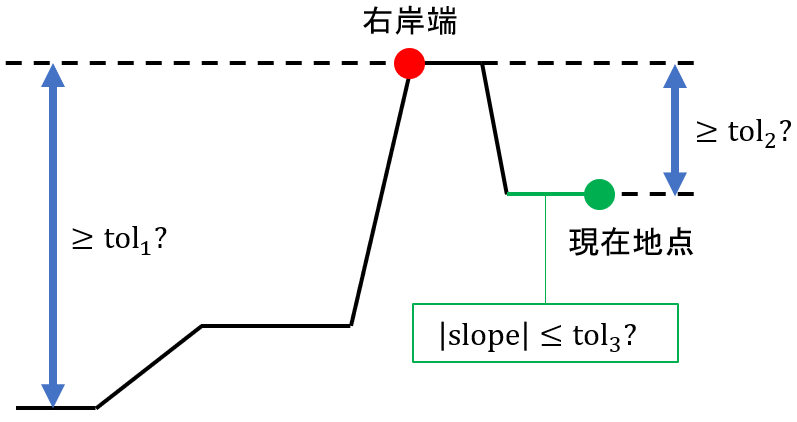

このリポジトリでは，日本の数値標高モデル（Degital Elevation Model, DEM）と国土数値情報の河川データから，氾濫解析用の河道縦横断データを自動抽出するPythonプログラムを公開しています．

このREADMEではプログラムの使用方法を段階に分けて説明します．

## 1. 必要なライブラリのインストール

このプログラムを用いるには，以下の2件のPythonライブラリが必要です．

- [PyShp](https://pypi.org/project/pyshp/)
- [Pyproj](https://github.com/pyproj4/pyproj)

お使いのPython環境にこれらのライブラリがインストールされていない場合は，プロンプト上で以下のコマンドを入力してインストールを行って下さい．
```
pip install pyshp
```
```
pip install pyproj
```

## 2. 河道中心線の抽出<a name="2"></a>

国土数値情報の河川データから，縦横断データの抽出対象となる河川の河道中心線のデータを取得します．

### 2-1. 河道中心線の抽出を行うプログラムの準備

[extract-centerline](./extract-centerline)に格納されている以下の2つのファイルをダウンロードし，同一のディレクトリに置いて下さい．

- [extract_centerline.py](./extract-centerline/extract_centerline.py)
- [input_extract_centerline.csv](./extract-centerline/input_extract_centerline.csv)

### 2-2. 国土数値情報・河川データの準備

下記URLから，対象の河川を含む都道府県のデータをダウンロードして下さい．

[https://nlftp.mlit.go.jp/ksj/jpgis/datalist/KsjTmplt-W05.html](https://nlftp.mlit.go.jp/ksj/jpgis/datalist/KsjTmplt-W05.html)

ダウンロードしたzipファイルに含まれている，W05-XX-XX.xmlという名前のファイルをextract_centerline.pyの置かれたディレクトリに置いて下さい．

### 2-3. 河川コードの指定

input_extract_centerline.csvを開き，二つの項目の設定を行ってから上書き保存して下さい．

各項目の意味は以下の通りです．

- Data file name: 国土数値情報のxmlファイルの名前（W05-XX-XX.xml）
- River code: 対象の河川の河川コード

河川コードは以下に示す，国土交通省のWebサイトで検索できます．

[https://nlftp.mlit.go.jp/ksj/gml/codelist/RiverCodeCd.html](https://nlftp.mlit.go.jp/ksj/gml/codelist/RiverCodeCd.html)

このリポジトリに置かれている[input_extract_centerline.csv](./extract-centerline/input_extract_centerline.csv)では，北海道の河川データのxmlファイルと，石狩川の河川コードが指定されています．

### 2-4. プログラムの実行<a name="2-4"></a>

extract_centerline.pyを実行して下さい．

```
python extract_centerline.py
```

プログラムが終了すると，以下のシェープファイル（およびその支援ファイル）が出力されます．

- river_centerline.shp: 指定された河川の河道中心線を構成するポイントのデータを格納したファイル

## 3. 河道縦横断データの抽出範囲の決定<a name="3"></a>

[2-4](#2-4)で取得したriver_centerline.shpを[QGIS](https://qgis.org/)などのGISソフトウェアで開き，記録されているポイントデータを閲覧して下さい．

QGISを利用する場合は，以下の手順でデータを閲覧できます．

1. ブラウザパネルから「OpenStreetMap」レイヤをプロジェクトに追加する
2. river_centerline.shpをQGISにドラッグ・アンド・ドロップする

ポイントデータは，属性としてidという識別番号を持ちます．識別番号は上流から下流に向けて昇順に並んでいます．

QGISを利用する場合は，以下の手順で属性データを確認できます．

1. メニューバーから「ビュー」→「地物情報を表示」を有効にする
2. 属性データを確認したいポイントをクリックする

ポイントデータをGISソフトウェア上で閲覧しながら，河道縦横断データの抽出範囲を決めて下さい．

抽出範囲を決めたら，その範囲の上流端のポイントの識別番号と，下流端のポイントの識別番号をメモして下さい．これらの識別番号は，河道縦横断データの抽出を行うプログラムに対して，抽出範囲を指示するために用いられます．

上流端のポイントは，抽出したい範囲から1kmほど上流に設定して下さい．これは，河道縦横断データの抽出を行うプログラムが，下流端のポイントから標高の読み取りを開始し，上流端のポイントの直前で標高の読み取りを終了するためです．そのため，上流端のポイントの標高は読み取られません．

## 4. 河道縦横断データの抽出

### 4-1. プログラムの準備

[code](./code)に格納されている以下の4つのファイルをダウンロードし，同一のディレクトリに置いて下さい．

- [extract_river_channel_shape.py](./code/extract_river_channel_shape.py)
- [dem.py](./code/dem.py)
- [open_channel.py](./code/open_channel.py)
- [basic_parameters.csv](./code/basic_parameters.csv)

### 4-2. 河道中心線のデータの準備

[2-4](#2-4)で取得したriver_centerline.shpとその支援ファイルをextract_river_channel_shape.pyの置かれたディレクトリに置いて下さい．

### 4-3. DEMデータの準備

下記URLから，河道縦横断データの抽出範囲を含む，5mメッシュDEMデータ（DEM5A, DEM5B, DEM5C）をダウンロードして下さい．

[https://fgd.gsi.go.jp/download/menu.php](https://fgd.gsi.go.jp/download/menu.php)

ダウンロードの手順は以下の通りです．

1. 「基盤地図情報　数値標高モデル」の「ファイル選択へ」をクリックする
2. 地図上で対象範囲の2次メッシュをクリックして全て選択する
3. 「ダウンロードファイル確認へ」をクリックする
4. 「このページをまとめてダウンロード」をクリックする
   - ファイルのダウンロードには基盤地図情報のサイトへのログインが必要です．アカウントは誰でも無料で作成できます．
   - ダウンロードするファイル数が多い場合には，ダウンロードファイルリストが複数ページに渡ることがあります．その場合には，ページごとに「このページをまとめてダウンロード」をクリックしなければいけません．

ダウンロードしたzipファイルには，FG-GML-XXXX-XX-DEM5X.zipという名前のファイルが含まれています．これらのzipファイルを全て展開し，中に含まれているFG-GML-XXXX-XX-XX-DEM5X-XXXXXXXX.xmlという名前のファイルを全て同一のフォルダに置いて下さい．Windows PCをお使いの場合は，zipファイルの展開に[7-zip](https://7-zip.opensource.jp/)の「ここに展開」機能を使うことにより，複数のzipファイルの展開を効率的に行えます．

DEMのxmlファイルを置いたフォルダの名前をelevationとし，extract_river_channel_shape.pyの置かれたディレクトリに置いて下さい．

ここまでの作業が完了し，extract_river_channel_shape.pyの置かれたディレクトリの内容が以下の図のようになっていれば，プログラムを実行するための準備が整ったことになります．


### 4-4. 基本パラメータの設定

basic_parameters.csvを開き，プログラムが使用する基本パラメータの設定を行って下さい．

csvファイルは20行2列のファイルで，各行が一つのパラメータに対応しています．1列目がパラメータ名，2列目がパラメータの設定値です．

20個のパラメータのうち，対象の河道に応じて設定値を変えなければいけないのは，最初の4つです．その他のパラメータについては，[code](./code)に格納されている[basic_parameters.csv](./code/basic_parameters.csv)の設定値をそのまま用いても構いません．[code](./code)に格納されているファイルでは，石狩川の河道の，夕張川との合流部から河口までの範囲を想定してパラメータ設定が行われています．

以下では，各パラメータの設定方法を整理します．

#### 4-4-1. Plane rectangular coordinate system

このパラメータは，対象の河道をカバーする平面直角座標系のEPSGコードです．

このプログラムは，デフォルトでは河道中心線に直交するように横断線を設定します．この設定において，地図上の角度の計算に平面直角座標系が利用されます．

EPSGコードは"epsg:6680"のように記載して下さい．

対象の河道をカバーする平面直角座標系のEPSGコードは，以下のURLから調べて下さい．

[https://lemulus.me/column/epsg-list-gis#2011JGD2011](https://lemulus.me/column/epsg-list-gis#2011JGD2011)

#### 4-4-2. Initial point ID, Terminal point ID

これらのパラメータはそれぞれ，[3](#3)で決定した上流端のポイントの識別番号と，下流端のポイントの識別番号です．

[3](#3)でも述べたように，上流端のポイントは，抽出したい範囲から1kmほど上流に設定して下さい．

#### 4-4-3. Flow

このパラメータは，対象の河道の代表地点の平水流量（単位：m3/s）です．

このパラメータは河床標高の設定に利用されます．

主要な河川であれば，平水流量のデータは[水文水質データベース](http://www1.river.go.jp/)から得られます．データの取得方法は以下の通りです．

1. 「観測所諸元からの検索」をクリックします
2. 「観測項目」に「水位流量」を，「河川名」に対象の河川を指定し，「検索」をクリックします
3. 観測所の検索リストが表示されますので，対象の河道内の，もしくは，その近辺の観測所を選択します
4. 「流況表検索」をクリックします
5. 「検索開始」をクリックします
6. 観測所の年別平水流量が表示されます

[code](./code)に格納されている[basic_parameters.csv](./code/basic_parameters.csv)のFlowには，石狩大橋観測所の1973年～2022年の平水流量の中央値が設定されています．

対象の河道の平水流量のデータが入手できない場合には，平水流量と流域面積の比流量を仮定してFlowを設定して下さい．

後に[5](./README.md#5)で述べるように，Flowの設定値は横断面ごとにカスタマイズできます．

#### 4-4-4. tol1-5, adjust1-3

これらのパラメータは横断線の範囲設定に利用されます．

このプログラムは，横断線の範囲設定を右岸側と左岸側に分けて行います．以下の図を用いて，右岸側の横断線の範囲設定の方法を述べます．左岸側の横断線の範囲設定も同様に行われます．



このプログラムは，河道中心線から右岸側に向けて一定間隔で進みながら，現在地点の標高の読み取りを行う作業を繰り返します．以下の3つの条件が全て満たされたとき，標高の読み取りが停止します．

1. 横断面内の最高の標高が，最低の標高よりもtol1(m)以上高い
2. 現在地点の標高が，横断面内の最高の標高よりもtol2(m)以上低い
3. 現在地点の勾配が，tol3以下である

標高読み取りの停止後，横断面内で最高の標高を有する地点が右岸端となります．

以上の横断線の範囲設定方法から確認できるように，tol1-3は対象の河道周辺の地形に応じて設定されることが望ましいです．tol1は河道の平均的な堤防の高さに設定されることが望ましいです．台形型の堤防が存在しない区間においては，tol2は0に設定されることが望ましいです．堤内地の地形の起伏が激しい区間においては，tol3が大きく設定されることが望ましいです．

ただし，このプログラムはtol1-3の値を自動調整するため，tol1-3の設定値が不適切でも，ある程度は対応することが可能です．

tol1-3の自動調整に用いられるのが，tol4-5とadjust1-3です．tol1-3の設定値が不適切だと，標高の読み取りが永久に終わらない可能性があります．そこで，以下の2つの条件のいずれかが満たされたときには，tol1-3の設定値を調整したうえで，標高の読み取りを河道中心線からやり直します．

1. 現在地点が河道中心線からtol4(m)以上離れている
2. 現在地点の標高が，最低の標高よりもtol5(m)以上高い

tol1, tol2, tol3の設定値の調整は，それぞれadjust1, adjust2, adjust3を掛け算することによって行われます．adjust1とadjust2には0より大きく1未満の定数を，adjust3には1よりも大きい定数を指定します．

[code](./code)に格納されている[basic_parameters.csv](./code/basic_parameters.csv)では，以下の設定値を用いています：tol1 = 8m, tol2 = 2m, tol3 = 0.05, tol4 = 1,000m, tol5 = 30m, adjust1 = 0.9, adjust2 = 0.5, adjust3 = 1.1．

後に[5](./README.md#5)で述べるように，tol1-5の設定値は横断面と左右岸ごとにカスタマイズできます．

#### 4-4-5. Distance between sections

このパラメータは，河道中心線に沿った，横断面の取得間隔（単位：m）です．

[code](./code)に格納されている[basic_parameters.csv](./code/basic_parameters.csv)では，200mに設定されています．

#### 4-4-6. Transverse interval

このパラメータは，横断方向の標高取得間隔（単位：m）です．

[code](./code)に格納されている[basic_parameters.csv](./code/basic_parameters.csv)では，1mに設定されています．

#### 4-4-7. Margin

横断線を設定する際に，河道（右岸端・左岸端）の外側に取るマージンの上限（単位：m）です．

上限値であるため，横断面によっては，この設定値よりも短いマージンしか取られないことがあります．

[code](./code)に格納されている[basic_parameters.csv](./code/basic_parameters.csv)では，30mに設定されています．

#### 4-4-8. iRIC format

河道縦横断データの出力形式を設定します．

1の場合は，無償の河川シミュレーションソフトウェアである，[iRIC](https://i-ric.org/ja/)が読み込める形式になります．

0の場合は，日立パワーソリューションズが開発した有償の洪水シミュレータである，[DioVISTA/Flood](https://www.hitachi-power-solutions.com/service/digital/diovista/flood/index.html)が読み込める形式になります．

[code](./code)に格納されている[basic_parameters.csv](./code/basic_parameters.csv)では，1に設定されています．

#### 4-4-9. 河床標高の設定に利用されるパラメータ<a name="4-4-9"></a>

以下の4つのパラメータは，DEMからは取得できない，水面下の河床標高を設定するのに利用されます．

- Difference in differential equation
- Roughness coefficient
- Minimum water surface slope
- Number of samples for median calculation

これらのパラメータには，[code](./code)に格納されている[basic_parameters.csv](./code/basic_parameters.csv)の設定値を用いて下さい．

これらのパラメータの意味については，[code](./code)の[README](./code/README.md)を見て下さい．

### 4-5. プログラムの実行<a name="4-5"></a>

extract_river_channel_shape.pyを実行して下さい．

```
python extract_river_channel_shape.py
```

初回のプログラムの実行時間は非常に長いです．これは，DEMから標高を読み取るコードの遅さによるものです．

プログラムが終了すると，extract_river_channel_shape.pyの置かれているディレクトリに，以下のcsvファイルが出力されます．

- intermediate_result.csv: DEMから読み取った標高データや横断線の範囲設定を記録したファイル（**編集しないで下さい**）
- setting.csv: 横断面別に平水流量やtol1-5を設定するためのファイル

また，extract_river_channel_shape.py](./code/extract_river_channel_shape.pyの置かれているディレクトリにoutputという名前のフォルダが作られ，その中に河道縦横断データが出力されます．

iRIC formatが1の場合には，以下のcsvファイルが出力されます．

- kui.csv: 杭位置座標データのファイル（iRIC形式）
- oudan/X.XXk.csv: 距離標がX.XXkの横断面の地形データを記録したファイル
- elevation.csv: 河床，水面，左岸端，右岸端の標高を縦断方向に記録したファイル

iRIC formatが0の場合には，以下のcsvファイルが出力されます．

- kui.csv: 杭位置座標データのファイル（DioVISTA/Flood形式）
- oudan.csv: 全横断面の地形データを記録したcsvファイル
- elevation.csv: 河床，水面，左岸端，右岸端の標高を縦断方向に記録したファイル

X.XXk.csvとoudan.csvはどちらも国土交通省の河川定期縦横断データのフォーマットに従っています．

### 4-6. 河道縦横断データの確認

[iRIC](https://i-ric.org/ja/)もしくは[DioVISTA/Flood](https://www.hitachi-power-solutions.com/service/digital/diovista/flood/index.html)を用いて，抽出された河道縦横断データを確認して下さい．

DioVISTA/Floodの方が確認を行いやすいです．DioVISTA/Floodは有償ソフトウェアですが，河道縦横断データの表示機能はFree Editionでも利用できます（シミュレーションは有償版でなければ行えません）．

以下に各ソフトウェアにおける確認方法を述べます．

#### iRIC

1. Nays2D Floodなど，適当なソルバーを選んでプロジェクトを開始する
2. メニューバーから「ファイル」→「プロパティ」を選択する
3. 「座標系」の「編集」をクリックする
4. basic_parameters.csvのPlane rectangular coordinate systemで設定した平面直角座標系を選択して「OK」をクリックする
5. メニューバーから「インポート」→「地理情報」→「地形」を選択する
6. プログラムが出力したkui.csvを開く
7. データをインポートするアルゴリズムとして「国土交通省 横断測量データ（*.csv）」を選択して「OK」をクリックする
8. oudanフォルダ（X.XXk.csvという名前のファイルを格納したフォルダ）を選択して「フォルダの選択」をクリックする
9. 河川測量データ インポート設定ウィンドウの「OK」をクリックする
10. オブジェクトブラウザーの「背景画像 (インターネット)」の「国土地理院 (標準地図)」にチェックを入れる

iRICではマウスを用いて地図の移動と拡大縮小を行えますが，この操作を行う際にはCtrlキーを押したままにしておく必要があります．

特定の横断面の地形を確認したい場合には，地図上で当該横断面の中心点を左クリックしてから，右クリックでメニューを出し，「横断面の表示」を選択して下さい．

#### DioVISTA/Flood

1. プロジェクトパネルの「河川」フォルダを右クリックし，「河川縦横断データのインポート」を選択する
2. プログラムが出力したkui.csvとoudan.csvが置かれているフォルダを選択して「フォルダの選択」をクリックする

DioVISTA/FloodではGoogle Mapと同様にして，マウスを用いた地図の移動と拡大縮小を行えます．

特定の横断面の地形を確認したい場合には，プロジェクトウィンドウで対象の河川を右クリックし，「断面図表示」を有効にして下さい．

## 5. 河道縦横断データの調整<a name="5"></a>

[4-5](./README.md#4-5)で抽出された河道縦横断データは，通常，不完全な状態です．

完全な状態にするには，プログラムの出力ファイルであるsetting.csvを用いた調整が必要です．

### 5-1. setting.csvの使い方

このcsvファイルは1行目がヘッダであり，2行目以降の各行は一つの横断面に対応しています．

各列のパラメータの定義は以下の通りです．

- Distance: 距離標(km)
- Use intermediate result: 前回のプログラム実行時に読み取った標高データを用いるか
- Flow: 平水流量(m3/s)
- Angle adjustment: 横断線の調整角度(°)
- Left tol1-5: 左岸側の横断線の範囲設定に用いられるtol1-5
- Left DEM: 左岸側の標高データの読み取りに用いられるDEMの種類(A, B, C)
- Right tol1-5: 右岸側の横断線の範囲設定に用いられるtol1-5
- Right DEM: 右岸側の標高データの読み取りに用いられるDEMの種類(A, B, C)

プログラムが出力したcsvファイルに記録されているパラメータの値は，プログラムが各横断面の横断線と断面形の設定に用いたものです．

抽出された横断面の中に，横断線の設定が思わしくないものが存在する場合には，setting.csvの当該横断面のパラメータを変更して上書き保存してから，プログラムを実行して下さい．これにより，当該横断面の横断線を修正できます．

横断面によって平水流量が異なる場合には，setting.csvのFlowを横断面別に設定して上書き保存してから，プログラムを実行して下さい．これにより，横断面別の河床標高をより正確に設定できます．

setting.csvはプログラムを実行する度に上書きされます．setting.csvの編集にExcelを用いる場合には，上書き保存の後に，**setting.csvを閉じてからプログラムを実行して下さい**．setting.csvがExcelで開かれていると，プログラムがPermissionErrorを出して停止します．

### 5-2. Use intermediate resultの設定

特定の横断面の横断線を調整する際には，当該横断面のUse intermediate resultの設定値を**以下の場合分けに従って設定して下さい**．

- 横断線を変更しない横断面：Use intermediate resultをデフォルトの1のままにしておいて下さい．
   - Flowの設定値のみを変更する場合もこのケースに該当します．Flowの設定値は横断線の設定には影響しません．
- Left tol1-5とRight tol1-5を変更する横断面：Use intermediate resultを2に設定して下さい．
- Angle adjustmentとLeft DEM, Right DEMを変更する横断面：Use intermediate resultを0に設定して下さい．

Use intermediate resultには0, 1, 2のいずれかを設定することができ，それぞれ以下の意味を持ちます．

- 0: 当該横断面の標高データの読み取りを一からやり直します
- 1: 当該横断面の標高データと横断線の範囲設定に，前回のプログラム実行時の結果を使います（デフォルト）
- 2: 当該横断面の横断線の範囲設定はやり直しますが，標高データには前回のプログラム実行時の結果を可能な限り使います

前回のプログラム実行時の標高データと横断線の範囲設定は，プログラムが出力するintermediate_result.csvに記録されています．このファイルは編集しないで下さい．

intermediate_result.csvを用いる利点は，プログラムの実行時間の短縮です．DEMから標高を読み取るコードは遅いため，前回のプログラム実行時の読み取り結果を可能な限り用いることにより，実行時間を短縮できます．

Use intermediate resultに2を設定した場合には，標高データが追加的に必要になった場合に限り，DEMから標高が読み取られます．

### 5-3. ケース別の横断線調整方法

ここでは，横断線の設定に問題が生じるケースを取り上げ，各ケースにおける具体的な調整方法を述べます．

#### 横断線が堤防まで届いていない


上の図のように横断線が堤防まで届いていないケースでは，以下のいずれか，もしくは両方を行って下さい．

- tol1を増やす：堤外地の隆起した地形が堤防として判定されている場合の対応です
- tol4を増やす：河道中心線から堤防までの距離がtol4(m)以上離れている場合の対応です


