このリポジトリでは，日本の数値標高モデル（Degital Elevation Model: DEM）と国土数値情報の河川データから，氾濫解析用の河道縦横断データを自動抽出するPythonプログラムを公開しています．

このREADMEではプログラムの使用方法を段階に分けて説明します．

プログラムについての問い合わせは，下記のメールアドレスにお願いします．


## 1. 必要なライブラリのインストール

このプログラムを用いるには，以下の3件のPythonライブラリが必要です．

- [PyShp](https://pypi.org/project/pyshp/)
- [Pyproj](https://github.com/pyproj4/pyproj)
- [rasterio](https://rasterio.readthedocs.io/en/stable/)

お使いのPython環境にこれらのライブラリがインストールされていない場合は，プロンプト上で以下のコマンドを入力してインストールを行って下さい．
```
pip install pyshp
```
```
pip install pyproj
```
```
pip install rasterio
```

## 2. 河道中心線の抽出<a name="2"></a>

国土数値情報の河川データから，縦横断データの抽出対象となる河川の河道中心線のデータを取得します．

### 2-1. 河道中心線の抽出を行うプログラムの準備

[extract-centerline](./extract-centerline)に格納されている以下の2つのファイルをダウンロードし，同一のディレクトリに置いて下さい．

- [extract_centerline.py](./extract-centerline/extract_centerline.py)
- [input_extract_centerline.csv](./extract-centerline/input_extract_centerline.csv)

### 2-2. 国土数値情報・河川データの準備

下記URLから，対象の河川を含む都道府県のデータをダウンロードして下さい．

[https://nlftp.mlit.go.jp/ksj/jpgis/datalist/KsjTmplt-W05.html](https://nlftp.mlit.go.jp/ksj/jpgis/datalist/KsjTmplt-W05.html)

ダウンロードしたzipファイルに含まれている，W05-XX-XX.xmlという名前のファイルをextract_centerline.pyの置かれたディレクトリに置いて下さい．

ディレクトリの内容が以下の図のようになっていれば，プログラムを実行するための準備が整ったことになります


### 2-3. 河川コードの指定

input_extract_centerline.csvを開き，二つの項目の設定を行ってから上書き保存して下さい．

各項目の意味は以下の通りです．

- Data file name: 国土数値情報のxmlファイルの名前（W05-XX-XX.xml）
- River code: 対象の河川の河川コード

河川コードは以下に示す，国土交通省のWebサイトで検索できます．

[https://nlftp.mlit.go.jp/ksj/gml/codelist/RiverCodeCd.html](https://nlftp.mlit.go.jp/ksj/gml/codelist/RiverCodeCd.html)

extract-centerlineに格納されている[input_extract_centerline.csv](./extract-centerline/input_extract_centerline.csv)では，北海道の河川データのxmlファイルと，石狩川の河川コードが指定されています．

### 2-4. プログラムの実行<a name="2-4"></a>

extract_centerline.pyを実行して下さい．

```
python extract_centerline.py
```

プログラムが終了すると，以下のシェープファイル（およびその支援ファイル）が出力されます．

- river_centerline.shp: 指定された河川の河道中心線を構成するポイントのデータを格納したファイル

## 3. 河道縦横断データの抽出範囲の決定<a name="3"></a>

[2-4](#2-4)で取得したriver_centerline.shpを[QGIS](https://qgis.org/)で開き，記録されているポイントデータを閲覧して下さい．

まず，QGISのレイヤとして地理院地図を使える状態にない場合には，以下のWebサイトを参考に，地理院地図をQGISのレイヤに追加して下さい．

[https://qgis.mierune.co.jp/posts/howto_1_add_xyztiles](https://qgis.mierune.co.jp/posts/howto_1_add_xyztiles)

地理院地図を使える場合は，以下の操作を行います．

1. ブラウザパネルの「XYZ Tiles」から「地理院地図」レイヤをプロジェクトに追加する
2. river_centerline.shpをQGISにドラッグ・アンド・ドロップする

ポイントデータは，属性としてidという識別番号を持ちます．識別番号は上流から下流に向けて昇順に並んでいます．

属性データは以下の手順で確認できます．

1. ツールバーのをクリックする
   - もしくはメニューバーから「ビュー」→「地物情報を表示」を有効にする
2. 属性データを確認したいポイントをクリックする

ポイントデータをGISソフトウェア上で閲覧しながら，河道縦横断データの抽出範囲を決めて下さい．

抽出範囲を決めたら，その範囲の上流端のポイントの識別番号と，下流端のポイントの識別番号をメモして下さい．これらの識別番号は，河道縦横断データの抽出を行うプログラムに対して，抽出範囲を指示するために用いられます．

上流端のポイントは，抽出したい範囲から1kmほど上流に設定して下さい．これは，河道縦横断データの抽出を行うプログラムが，下流端のポイントから一定間隔で，上流端のポイントの手前まで横断面を配置するためです．そのため，上流端のポイント上には横断面が配置されません．

## 4. 河道縦横断データの抽出

### 4-1. プログラムの準備

[code](./code)に格納されている以下の8つのファイルを全てダウンロードし，同一のディレクトリに置いて下さい．

- [gui_main.py](./code/gui_main.py)
- [river_extractor.py](./code/river_extractor.py)
- [basic_parameters.csv](./code/basic_parameters.csv)
- [dem.py](./code/dem.py)
- [dem1a.py](./code/dem1a.py)
- [open_channel.py](./code/open_channel.py)
- [rotation.py](./code/rotation.py)
- [flow_accumulation_area.py](./code/flow_accumulation_area.py)

### 4-2. 河道中心線のデータの準備

[2-4](#2-4)で取得したriver_centerline.shpとその支援ファイルをextract_river_channel_shape.pyの置かれたディレクトリに置いて下さい．

### 4-3. DEMデータの準備

このPythonプログラムは，5mメッシュDEMデータ（DEM5A, DEM5B, DEM5C）と1mメッシュDEMデータ（DEM1A）の双方に対応しています．

ただし，DEM1Aは未整備の地域も多いため，利用可能かどうかは国土地理院のWebサイトで確認して下さい．

[https://service.gsi.go.jp/kiban/app/help/#digital_elevation_model](https://service.gsi.go.jp/kiban/app/help/#digital_elevation_model)

5mメッシュDEMと1mメッシュDEMのどちらを利用するか決めたら，河道縦横断データの抽出範囲を含むDEMデータを，下記URLからダウンロードして下さい．

[https://service.gsi.go.jp/kiban/](https://service.gsi.go.jp/kiban/)

ダウンロードの手順は以下の通りです．

1. 「基盤地図情報」の「数値標高モデル」をクリックする
2. 地図上で対象範囲の2次メッシュをクリックして全て選択する
3. 「検索結果リスト」タブの「ダウンロードリストに全て追加」をクリックする
4. 「ダウンロードリスト」タブの「ダウンロード等へ」をクリックする
5. 「ダウンロードファイルリスト」の「まとめてダウンロード」をクリックする
   - ファイルのダウンロードには国土地理院のサイトへのログインが必要です．アカウントは誰でも無料で作成できます．

ダウンロードしたzipファイルには，FG-GML-XXXXXX-DEMXX-XXXXXXXX.zipという名前のファイルが含まれています（Xには数字もしくはA, B, Cが入ります）．

これらのzipファイルを全て展開して下さい．Windows PCをお使いの場合は，zipファイルの展開に[7-zip](https://7-zip.opensource.jp/)の「ここに展開」機能を使うことにより，複数のzipファイルの展開を効率的に行えます．

zipファイルを展開して得られるFG-GML-XXXX-XX-XX-DEMXX-XXXXXXXX.xmlという名前のファイルを全て同一のフォルダに置き，フォルダの名前をelevationとして下さい．elevationフォルダの内容は以下の図のようになります．


elevationフォルダはriver_extractor.pyの置かれたディレクトリに置いて下さい．

### 4-4. 上流集水面積データの準備（任意）<a name="4-4"></a>

本手法は，DEMからは得られない水面下の水深を推定するために，横断面別の平水流量の設定を必要とします．

横断面別の平水流量の設定には，J-FlwDir: Japan Flow Direction Map / 日本域表面流向マップの上流集水面積のデータを利用できます．

[https://hydro.iis.u-tokyo.ac.jp/~yamadai/JapanDir/](https://hydro.iis.u-tokyo.ac.jp/~yamadai/JapanDir/)

データを利用しない場合には，ダウンロードは不要です．

ダウンロードするにはユーザー登録が必要です．ユーザー登録は誰でも無料で行えます．

ユーザー登録を完了したら，「Data Download / ダウンロード」セクションの「Flow Accumulation Area / 上流集水面積」のupa_v1.4.tarをダウンロードして下さい．

[7-zip](https://7-zip.opensource.jp/)の「展開」機能などを用いて，upa_v1.4.tarを展開して下さい．

展開すると，日本全国のメッシュ別上流集水面積を記録したtifファイルを含む，upaという名前のフォルダが出てきます．

このupaという名前のフォルダを，リネームせずに，river_extractor.pyの置かれたディレクトリに置いて下さい

### 4-5. ファイルの確認

ここまでの作業が完了し，river_extractor.pyの置かれたディレクトリの内容が以下の図のようになっていれば，プログラムを実行するための準備が整ったことになります（上流集水面積データを利用しない場合には，upaという名前のフォルダは不要です）．


### 4-6. 基本パラメータの設定

basic_parameters.csvを開き，プログラムが使用する基本パラメータの設定を行って下さい．

csvファイルは25行2列のファイルで，各行が一つのパラメータに対応しています．1列目がパラメータ名，2列目がパラメータの設定値です．

25個のパラメータのうち，**ユーザーが必ず設定しなければいけないのは，以下の4つです**．

- Plane rectangular coordinate system
- Initial point ID
- Terminal point ID
- Flow

この他のパラメータについては，[code](./code)に格納されている[basic_parameters.csv](./code/basic_parameters.csv)の設定値をそのまま用いて構いません．この設定値は，石狩川下流部を対象に設定されています．[5](#5)や[6](#6)に載せている適用事例は，石狩川下流部を対象としたものですので，コードの使用方法を確認するのにお使い下さい．

以下では，各パラメータの設定方法を整理します．

#### 4-6-1. Plane rectangular coordinate system

このパラメータは，対象の河道をカバーする平面直角座標系のEPSGコードです．

EPSGコードは"epsg:6680"のように記載して下さい．

対象の河道をカバーする平面直角座標系のEPSGコードは，以下のURLから調べて下さい．

[https://lemulus.me/column/epsg-list-gis#2011JGD2011](https://lemulus.me/column/epsg-list-gis#2011JGD2011)

#### 4-6-2. Initial point ID, Terminal point ID

これらのパラメータはそれぞれ，[3](#3)で決定した上流端のポイントの識別番号と，下流端のポイントの識別番号です．

[3](#3)でも述べたように，上流端のポイントは，抽出したい範囲から1kmほど上流に設定して下さい．

#### 4-6-3. Flow

このパラメータは，対象の河道の代表地点の平水流量（単位：m3/s）です．

このパラメータは水深の推定に利用されます．

主要な河川であれば，平水流量のデータは[水文水質データベース](http://www1.river.go.jp/)から得られます．データの取得方法は以下の通りです．

1. 「観測所諸元からの検索」をクリックします
2. 「観測項目」に「水位流量」を，「河川名」に対象の河川を指定し，「検索」をクリックします
3. 観測所の検索リストが表示されますので，対象の河道内の，もしくは，その近辺の観測所を選択します
4. 「流況表検索」をクリックします
5. 「検索開始」をクリックします
6. 観測所の年別平水流量が表示されます

対象の河道の平水流量のデータが入手できない場合には，平水流量と上流集水面積の比を仮定し，Flowを設定して下さい．

上流集水面積のデータは，[J-FlwDir](https://hydro.iis.u-tokyo.ac.jp/~yamadai/JapanDir/)から得られます．[4-4](#4-4)でダウンロードしたtifファイルをQGISで開けば，任意の地点の上流集水面積を確認できます．

#### 4-6-4. Estimate water depth

DEMからは得られない水深を推定するかどうかを設定します（0：推定しない，1：推定する）．

推定しない場合，水深はゼロとして河床標高の設定が行われます．

**初回実行時は0にして下さい**．

#### 4-6-5. Clear crossings

横断面の交差を解消するための回転を行うかどうかを設定します（0：回転しない，1：回転する）．

**初回実行時は0にして下さい**．

#### 4-6-6. tol1-3

これらのパラメータは左岸端・右岸端の位置設定に利用されます．

このプログラムは，横断面の範囲設定を右岸側と左岸側に分けて行います．

以下の図を用いて，右岸側の横断面の範囲設定の方法を述べます．左岸側の横断面の範囲設定も同様に行われます．


このプログラムは，河道中心線から右岸側に向けて一定間隔で進みながら，現在地点の標高の読み取りを行う作業を繰り返します．

以下の3つの条件が全て満たされたとき，標高の読み取りが停止します．

1. 最低の標高と最高の標高の差がtol1(m)以上である
2. 現在地点の標高と最高の標高の差がtol2(m)以上である
3. 現在地点の勾配がtol3以下である

標高読み取りの停止後，最高の標高を有する地点が右岸端となります．

#### 4-6-7. tol4-5, adjust1-3

tol1-3の自動調整に用いられるのが，tol4-5とadjust1-3です．

tol1-3の設定値が不適切だと，標高の読み取りが永久に終わらない可能性があります．そこで，以下の2つの条件のいずれかが満たされたときには，tol1-3の設定値を調整したうえで，標高の読み取りを河道中心線からやり直します．

- 現在地点が河道中心線からtol4(m)以上離れている
- 現在地点の標高が，最低の標高よりもtol5(m)以上高い

tol1, tol2, tol3の設定値の調整は，それぞれadjust1, adjust2, adjust3を掛け算することによって行われます．

#### 4-6-8. DEM type

標準的に使用するDEMを記載します．

- 5mメッシュDEM: Aと記載して下さい
- 1mメッシュDEM: 1Aと記載して下さい

AはDEM5Aを意味します．Aと記載しておけば，DEM5Aが利用できる場所では5Aを，利用できない場所では5Bを，5Bも利用できない場所では5Cを，という具合に，自動的に利用するDEMを変更します（5B, 5Cは写真測量で，5Aより精度が低い）．

#### 4-6-9. Distance between sections

このパラメータは，河道中心線に沿った，横断面の取得間隔（単位：m）です．

#### 4-6-10. Transverse interval

このパラメータは，横断方向の標高取得間隔（単位：m）です．

#### 4-6-11. Margin

横断線を設定する際に，河道（右岸端・左岸端）の外側に取るマージンの上限（単位：m）です．

河道外の地形を完全に切り捨てたい場合には，0mに設定して下さい．

#### 4-6-12. iRIC format

河道縦横断データの出力形式を設定します．

1の場合は，無償の河川シミュレーションソフトウェアである，[iRIC](https://i-ric.org/ja/)が読み込める形式になります．

0の場合は，日立パワーソリューションズが開発した有償の洪水シミュレータである，[DioVISTA/Flood](https://www.hitachi-power-solutions.com/service/digital/diovista/flood/index.html)が読み込める形式になります．

#### 4-6-13. 水深の推定に利用されるパラメータ<a name="4-6-13"></a>

以下の6つのパラメータは，DEMからは取得できない，水深を推定するのに利用されます．詳細については，[code](./code)の[README](./code/README.md)を見て下さい．

- Water surface tolerance
- Difference in differential equation
- Roughness coefficient
- Minimum water surface slope
- Number of samples for median water surface
- Number of samples for median riverbed

### 4-7. GUI

#### 4-7-1. GUIの起動

gui_main.pyを実行して下さい．

```
python gui_main.py
```

すると，以下のようなウィンドウが立ち上がるとともに，river_extractor.pyの置かれているディレクトリに，settings.csvというファイルが出力されます．

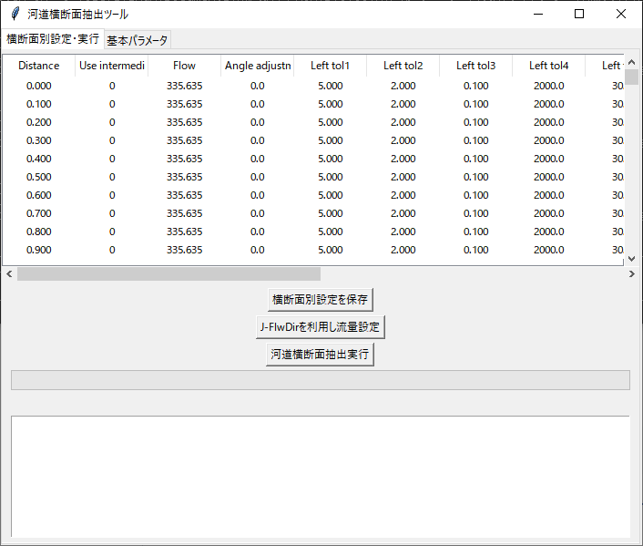

このGUI上でプログラムの操作を行います．

#### 4-7-2. 基本パラメータタブ

「基本パラメータ」タブでは，basic_parameters.csvの編集が行えます．

設定を変更したいセルをダブルクリックすれば編集できます．

「保存」ボタンをクリックするとbasic_parameters.csvの上書き保存が行われます．

#### 4-7-3. 横断面別設定・実行タブ

##### 4-7-3-1. settings.csvの編集<a name="4-7-3-1"></a>

「横断面別設定・実行」タブの上部には，settings.csvの内容が表示されています．

このcsvファイルは，横断面別の平水流量やtol1-5の設定値を格納したファイルです．

各行が一つの横断面に対応しています．各列のパラメータの定義は以下の通りです．

- Distance: 下流端からの距離(km)
- Use intermediate result: 前回のプログラム実行時に読み取った標高データを用いるか
- Flow: 平水流量(m3/s)
- Angle adjustment: 横断線の調整角度(反時計回り，度)
- Left tol1-5: 左岸端の位置設定に用いられるtol1-5
- Left DEM: 左岸側の標高データの読み取りに用いられるDEMの種類(A, B, C, 1A)
- Right tol1-5: 右岸端の一設定に用いられるtol1-5
- Right DEM: 右岸側の標高データの読み取りに用いられるDEMの種類(A, B, C, 1A)
- W.S.T.: [7](#7)で後述，デフォルト値は0

デフォルトでは，Flow, tol1-5, DEMには，basic_parameters.csvの設定が，全ての横断面に適用されています．

Angle adjustmentのデフォルト値は0度で，これは，横断面を河道中心線に対して垂直に配置することを意味します．

settings.csvを編集したい場合には，設定を変更したいセルをダブルクリックすれば編集できます．

「横断面別設定を保存」ボタンをクリックするとsettings.csvの上書き保存が行われます．

settings.csvの対話的な編集方法については，[5](#5), [6](#6), [7](#7)で説明します．

**初回実行時には，settings.csvを編集する必要はありません**．

##### 4-7-3-2. J-FlwDirを利用した流量設定

「横断面別設定・実行」タブの中ほどにある，「J-FlwDirを利用し流量設定」ボタンをクリックすると，[J-FlwDir](https://hydro.iis.u-tokyo.ac.jp/~yamadai/JapanDir/)の上流集水面積のデータを利用して，横断面別の平水流量を設定できます．

ボタンをクリックすると，小さいウィンドウが立ち上がりますので，比流量（平水流量と上流集水面積の比，単位はm3/s / km2）を入力し，「OK」をクリックして下さい．

横断面別の平水流量が計算され，settings.csvのFlowの列が自動的に書き換わります．

この機能を使うには，[4-4](./README.md#4-4)に従い，upaフォルダが準備されている必要があります．

##### 4-7-3-3. 河道縦横断データの抽出<a name="4-7-3-3"></a>

「横断面別設定・実行」タブの中ほどにある，「河道横断面抽出実行」ボタンをクリックすると，basic_parameters.csvとsettings.csvの設定に基づき，河道縦横断データの自動抽出が実行されます．

この過程で横断面別のtol1-tol3の自動調整が行われ，調整後の数値がsettings.csvに反映されます．

抽出が終了すると，river_extractor.pyの置かれているディレクトリに，以下のcsvファイルが出力されます．

- intermediate_result.csv: DEMから読み取った標高データや左岸端・右岸端の位置を記録したファイル（**編集しないで下さい**）

また，river_extractor.pyの置かれているディレクトリにoutputという名前のフォルダが作られ，その中に河道縦横断データが出力されます．

iRIC formatが1の場合には，以下のcsvファイルが出力されます．

- kui.csv: 杭位置座標データのファイル（iRIC形式）
- oudan/X.XXXk.csv: 距離標がX.XXXkの横断面の地形データを記録したcsvファイル
- elevation.csv: 河床（Riverbed），水面（Water surface），岸端（Stake）の標高を縦断方向に記録したcsvファイル
- river_channel.shpとその補助ファイル: 左岸線，右岸線，横断面とその諸元（左岸端・右岸端・河床の標高）を記録したシェープファイル

iRIC formatが0の場合には，以下のcsvファイルが出力されます．

- kui.csv: 杭位置座標データのファイル（DioVISTA/Flood形式）
- oudan.csv: 全横断面の地形データを記録したcsvファイル
- elevation.csv: 河床（Riverbed），水面（Water surface），岸端（Stake）の標高を縦断方向に記録したcsvファイル
- river_channel.shpとその補助ファイル: 左岸線，右岸線，横断面とその諸元（左岸端・右岸端・河床の標高）を記録したシェープファイル

X.XXXk.csvとoudan.csvはどちらも国土交通省の河川定期縦横断データのフォーマットに従っています．

### 4-8. 河道縦横断データの確認

河道縦横断データの確認には[QGIS](https://qgis.org/)を用います．QGISの基本操作については[3](./README.md#3)を参照して下さい．

確認の手順は以下の通りです．

1. ブラウザパネルの「XYZ Tiles」から「地理院地図」レイヤをプロジェクトに追加する
2. outputフォルダのriver_channel.shpをQGISにドラッグ・アンド・ドロップする

river_channel.shpをQGIS上で開くと，以下のように複数のラインデータが表示されます．


河道の左側に引かれているライン（Left）は，左岸線（左岸側の最大標高を有する点を結んだ線）です．河道の右側に引かれているライン（Right）は，右岸線です．

地理院地図には，堤防などの盛土の範囲が示されているため，左岸線と右岸線の位置の妥当性を確認する際に便利です（必ずしも完全に一致するわけではありません）．

左岸線，右岸線以外のラインは全て横断面を表します．横断面のラインは，属性データとして以下の4つを持ちます．

- name: 下流端から何kmの地点の横断面か
- left_bank: 左岸端の標高（左岸側の最大標高，単位：m）
- right_bank: 右岸端の標高（左岸側の最大標高，単位：m）
- riverbed: 河床標高（単位：m）

河道縦横断データの確認は，[iRIC](https://i-ric.org/ja/)もしくは[DioVISTA/Flood](https://www.hitachi-power-solutions.com/service/digital/diovista/flood/index.html)でも行えます．ただし，QGISとは異なり，これらのソフトウェアにはリロード機能が無いため，最終的な河道縦横断データが得られるまでは使わない方が良いです．以下に各ソフトウェアにおける確認方法を述べます．

#### 4-8-1. iRIC

1. Nays2D Floodなど，適当なソルバーを選んでプロジェクトを開始する
2. メニューバーから「ファイル」→「プロパティ」を選択する
3. 「座標系」の「編集」をクリックする
4. basic_parameters.csvのPlane rectangular coordinate systemで設定した平面直角座標系を選択して「OK」をクリックする
5. メニューバーから「インポート」→「地理情報」→「地形」を選択する
6. プログラムが出力したkui.csvを開く
7. データをインポートするアルゴリズムとして「国土交通省 横断測量データ（*.csv）」を選択して「OK」をクリックする
8. oudanフォルダ（X.XXXk.csvという名前のファイルを格納したフォルダ）を選択して「フォルダの選択」をクリックする
9. 河川測量データ インポート設定ウィンドウの「OK」をクリックする
10. オブジェクトブラウザーの「背景画像 (インターネット)」の「国土地理院 (標準地図)」にチェックを入れる

iRICではマウスを用いて地図の移動と拡大縮小を行えますが，この操作を行う際にはCtrlキーを押したままにしておく必要があります．

特定の横断面の地形を確認したい場合には，地図上で当該横断面の中心点を左クリックしてから，右クリックでメニューを出し，「横断面の表示」を選択して下さい．

#### 4-8-2. DioVISTA/Flood

1. プロジェクトパネルの「河川」フォルダを右クリックし，「河川縦横断データのインポート」を選択する
2. プログラムが出力したkui.csvとoudan.csvが置かれているフォルダを選択して「フォルダの選択」をクリックする

DioVISTA/FloodではGoogle Mapなどと同様に，マウスを用いた地図の移動と拡大縮小を行えます．

特定の横断面の地形を確認したい場合には，プロジェクトウィンドウで対象の河川を右クリックし，「断面図表示」を有効にして下さい．

## 5. 左岸端・右岸端の位置調整<a name="5"></a>

[4-7-3-3](#4-7-3-3)で抽出された河道縦横断データは，通常，左岸端・右岸端の位置が不適切な横断面を含みます．

これを修正するためには，settings.csvを用いた調整が必要です．settings.csvの編集は，[4-7-3-1](#4-7-3-1)で述べたように，GUI上で行えます．

抽出された横断面の中に，左岸端・右岸端の位置が不適切なものが存在する場合には，当該横断面のパラメータを編集して下さい．このとき，**当該横断面のUse intermediate resultを0に変更して下さい**．

Use intermediate resultが1の場合，前回の左岸端・右岸端の設定が再利用されます．逆に，左岸端・右岸端の位置修正が不要な横断面については，Use intermediate resultを1のままにして下さい．抽出に要する時間を短縮できます．

settings.csvの編集が終わったら，**「横断面別設定を保存」ボタンをクリックしてから**，河道横断面抽出を再度実行して下さい．これにより，編集後のsettings.csvが反映された横断面が抽出されます．

横断面の再抽出後は，QGISの再読み込み（リロード）機能を使い，シェープファイルの再読み込みを行って下さい．この機能は，をクリックするか，F5キーを押すことで使えます．

なお，settings.csvの編集はExcelで行うこともできます．ただし，その場合には，settings.csvを上書き保存した後に，必ずファイルを閉じて下さい．ファイルを開いたままだとExcelの編集ロック機能のため，プログラム実行時にエラーが出ます．

以下では，左岸端・右岸端の位置が不適切なケースを取り上げ，各ケースにおける具体的な調整方法を述べます．

### 5-1. 横断面が堤防まで届いていない

以下の図の例を見て下さい．

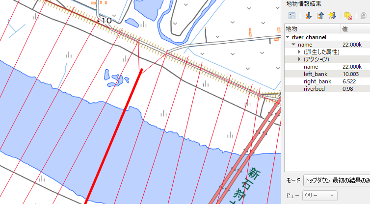

22.0kの横断面の右岸側が堤防に届いていません．

このような横断面については，以下の対応のいずれか，もしくは両方を行って下さい．

- tol1を増やす：tol1が堤防の高さよりも過度に低い場合の対応です
- tol4を増やす：河道中心線から堤防までの距離がtol4(m)以上離れている場合の対応です

上記の例では，右岸側のtol1が低過ぎることが原因だと考えられたため，22.0kのUse intermediate resultを0に設定し，Right tol1を5m→10mに変更しました．

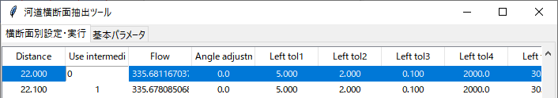


「横断面別設定を保存」ボタンをクリックしてから，河道横断面抽出を再度実行した結果，横断面が以下のように修正されました．

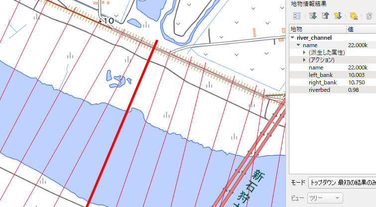

なお，人工堤防が存在する区間においては，**tol2を正に設定しないと，横断面が天端まで届かないことが多い**です．

自動調整の結果，人工堤防が存在する区間においてtol2がゼロになることがあります．この場合は，0.1mなどごく小さい数値でも構いませんので，tol2を正に設定することを推奨します．

### 5-2. 横断面が堤内地の奥まで伸びている<a name="5-2"></a>

以下の図の例を見て下さい．

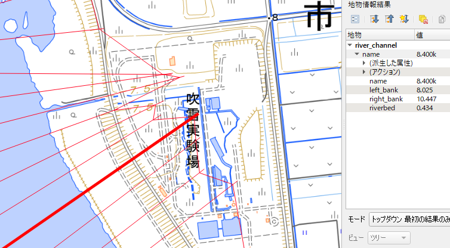

8.4kとその周辺の横断面の右岸側が，堤防を大幅に超過しています．

このような横断面については，以下の対応のいずれか，もしくは全てを行って下さい．

- tol1を減らす：tol1が堤外地側から見た堤防の高さよりも高い場合の対応です
- tol2を減らす：tol2が堤内地側から見た堤防の高さよりも高い場合の対応です
- tol3を増やす：堤内地に平坦な地形が存在しない場合の対応です

上記の例では，右岸側のtol2が高すぎることが原因だと考えられたため，8.4kとその周辺の横断面のUse intermediate resultを0に設定し，Right tol2を2m→0.1mに変更しました．

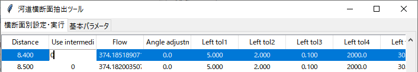


「横断面別設定を保存」ボタンをクリックしてから，河道横断面抽出を再度実行した結果，横断面が以下のように修正されました．

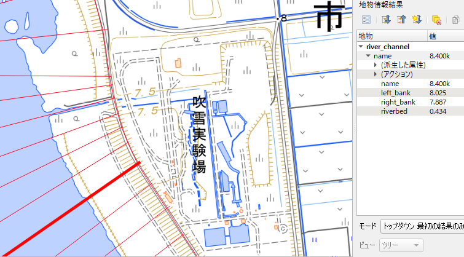

### 5-3. DEMから標高が得られない

このプログラムは「DEMに標高が記録されていない場所は水面である」という前提の下に処理を行います．

そのため，「DEMに標高が記録されていない陸地」が横断面上に存在すると，横断面形の設定が適切に行えません．

Left DEMやRight DEMの設定がAの場合には，標高データが（一部でも）存在する3次メッシュではDEM5Aが利用され，そうでない3次メッシュではDEM5B（あるいはDEM5C）が利用されます．

稀なケースですが，DEM5Aの標高データが存在する場所と存在しない場所が混在する3次メッシュがあります（例えば[6441-54-52](https://maps.gsi.go.jp/#14/43.125638/141.527853/&base=std&ls=std%7Cchiikimesh%7Cfgd_dem5a_area_dtil&disp=111&lcd=fgd_dem5a_area_dtil&vs=c1g1j0h0k0l0u0t0z0r0s0m0f0&d=m)）．

こうした場所でDEM5Aを利用しようとすると，横断面形の設定が適切に行えません．

例えば，以下の図を見て下さい．

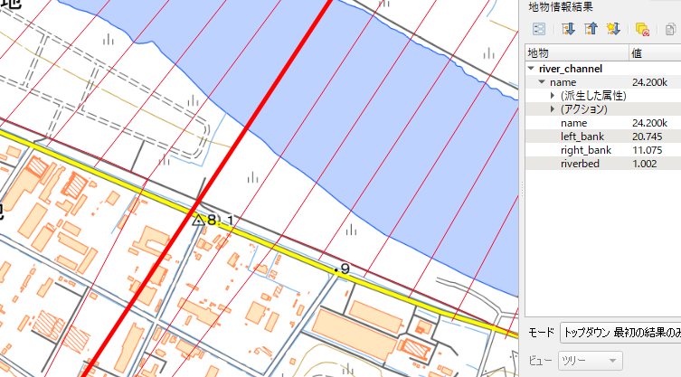

24.2kと24.3kの横断面の左岸側が堤防を超過しています．しかし，[5-2](#5-2)の例とは異なり，tol1-tol3をどのように調整しても，左岸端を適切な位置に調整することができません．

実は，この横断面の左岸側は，DEM5Aの標高データが存在しないのです．このような横断面には，以下の対応を行って下さい．

- 用いるDEMをBまたはCにする

上記の例では，DEM 5Bは利用可能であったため，24.2kと24.3kの横断面のUse intermediate resultを0に設定し，Left DEMをA→Bに変更しました．

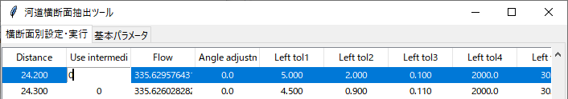


「横断面別設定を保存」ボタンをクリックしてから，河道横断面抽出を再度実行した結果，横断面が以下のように修正されました．

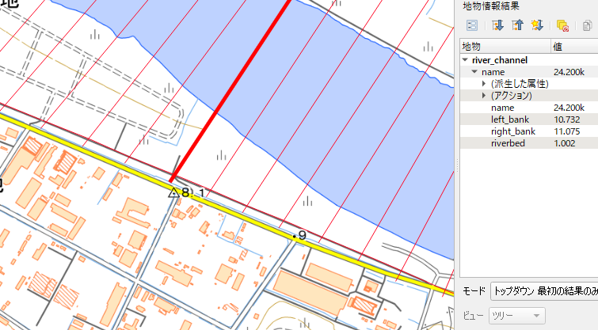

### 5-4. 人工堤防が存在しない

上流部や河口部，あるいは，河道が丘陵や山の脇を通るような場所では，人工堤防が存在しないことがあります．

このような場所では，河道の範囲が曖昧であるため，左岸端・右岸端の位置の裁量的に設定できるケースが多いと考えられます．

ただし，川のすぐ横が市街地であるような場所もあり，このような場所においては，適切な地点で横断面を止める必要があります．

人工堤防が存在しない横断面において，横断面を「適切な地点」で止めるには，以下の対応を行って下さい．

- tol2を0にする
- tol3を0.1にする
- tol1を堤外地と「適切な地点」の標高差に設定する

例えば，以下の図を見て下さい．これは石狩川河口部の横断面の様子です．


石狩川河口部には人工堤防が存在せず，このような区間でtol2 > 0を設定すると，横断面が氾濫原の奥まで伸びてしまいます．

そこで，人工堤防が存在しない区間については，Use intermediate resultを0に設定し，tol2を0mに，tol3を0.1に変更しました．tol1は石狩川河口部の地形を鑑み，3mに変更しました．

「横断面別設定を保存」ボタンをクリックしてから，河道横断面抽出を再度実行した結果，左岸端・右岸端が水路周辺の小高い場所に設定されていることが確認できます．

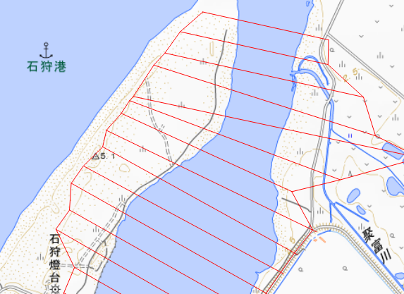

## 6. 横断面の回転による交差解消<a name="6"></a>

以下の図の例を見て下さい．


交差している横断面の存在が確認できます．このような横断面の交差は，水理解析用のソフトウェアで河道モデルの計算格子を作成する際に問題になります．

本プログラムは，横断面を回転することにより，このような横断面の交差を自動的に解消することができます．

この機能を用いる場合には，「基本パラメータ設定」タブからClear crossingsの設定を0→1に書き換え，「保存」ボタンを押して下さい．

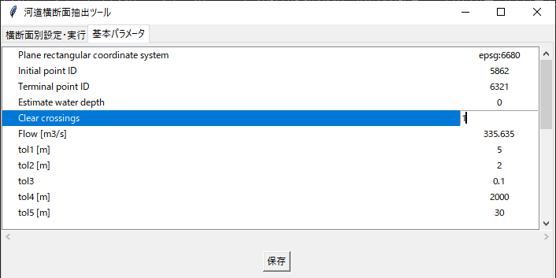

Clear crossingsが1の状態で河道横断面抽出を行うと，横断面の回転による交差解消が行われます．

このとき，回転が必要な横断面のUse intermediate resultを0に設定する必要はありません．Use intermediate resultの設定によらず，交差している横断面は全て回転の対象となります．

回転の過程はGUI上には表示されませんが，Pythonを実行しているプロンプト上には，回転の行われている横断面と，その回転角が表示されます．

横断面抽出が完了すると，settings.csvのAngle adjustmentに回転が反映されます．

以下の図は，先ほどの例の回転後の様子です．横断面の交差が解消されていることが確認できます．


回転された横断面の左岸端・右岸端は不適切な位置にあることがあります．その場合には，当該横断面の左岸端・右岸端の再調整を実行して下さい．

横断面の回転機能は，横断面の左岸端・右岸端が概ね適切な位置にあることを前提としています．**[5](#5)の調整が一旦完了するまでは，Clear crossingsを0にして横断面抽出を行って下さい**．

一度調整が完了したら，それ以降はClear crossingsを1のままにして構いません．

## 7. 水深の推定<a name="7"></a>

[5](#5)と[6](#6)の調整が完了し，全ての横断面が適切な位置に配置されたら，水深の推定機能をONにします．

水深の推定には時間がかかるため，横断面の位置の調整が済むまでは，この機能をOFFにしておいた方が良いです．

水深の推定機能をONにするには，「基本パラメータ設定」タブからEstimate water depthの設定を0→1に書き換え，「保存」ボタンを押して下さい．


Estimate water depthが1の状態で河道横断面抽出を行うと，横断面別の水深の推定が行われ，横断面形に推定結果が反映されます．

横断面別の水面（低水路）の区間を，プログラムが自動的に検出し，その区間の標高が水深の分だけ低く設定されます．

ただし，横断面によっては，水面の区間の推定に失敗することがあります．

水面の区間の推定の失敗は目視で確認します．

outputフォルダに出力される，elevation.csvを開き，Raw riverbedの列をグラフ化して下さい．

これは，不等流の基礎式を用いて推定された，平滑化前の河床標高になります．

例えば，Raw riverbedのグラフが以下の図のようになったとします．


Raw riverbedのグラフは数m程度の振幅で振動するのですが，図中で赤い〇で示した箇所のように，明らかに極端な落ち込みを示す横断面が見つかることがあります．

このような横断面では，**水面の区間の幅が実態よりも過小に評価されている可能性が高いです**．

このような横断面については，settings.csvのW.S.T.を1に設定して下さい．


そのうえで，「横断面別設定を保存」ボタンをクリックしてから，河道横断面抽出を再度実行して下さい．このとき，当該横断面のUse intermediate resultを0に設定する必要はありません．

うまくいけば，Raw riverbedのグラフの極端な落ち込みが解消されます．

解消されない場合には，解消が見られるまで，W.S.T.の値を1刻みで増やして下さい．

### 7-1. W.S.T.の補足説明

W.S.T.は，Water surface toleranceの略で，basic parameters.csvで設定されるWater surface toleranceと本質的に同じものです．

詳細は[code](./code)の[README](./code/README.md)に記載されていますが，DEM 5Aの仕様が2025年3月以降に更新されたものと，それ以前のものでは異なっており，仕様に応じて水面の区間の推定方法を変える必要があります．

W.S.T.が0の場合は，DEMの仕様をプログラムが自動的に判定します．

2025年3月以降の仕様と判断した場合には，basic parameters.csvのWater surface toleranceを$`\Delta_i`$に設定して，水面の区間の推定を行います．

この自動判定を誤り，2025年3月以降のDEMに対して，それ以前のDEMに適用すべき推定手法を用いると，水面の区間の幅の過小評価に繋がります．

W.S.T.が正の値の場合には，2025年3月以降の仕様のDEMに適用すべき推定手法を強制的に用います．その場合，$`\Delta_i`$の設定値にはW.S.T.が使われます．

## 8. 適用事例

いくつかの適用事例について，河道縦横断データの抽出に用いたbasic_parameters.csvと，調整済みのsettings.csvを公開します．

#### [石狩川（北海道，河川コード：8101030001）河口部～神居古潭100m間隔](./examples/ishikari-gawa)

2025年5月時点で最新版のDEM5A, DEM5Bを対象としています．
